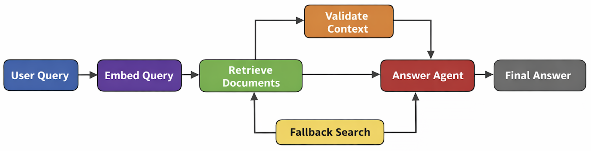

# Retail Insights Assistant

An intelligent, scalable **GenAI-based assistant** for querying retail sales data using:
- **OpenAI Chat + Embeddings**
- **LangGraph Agentic Framework**
- **PostgreSQL + pgvector**
- **Streamlit UI**
---

## Workflow Diagram


## Project Structure
```
retail-insights-assistants
├── app.py
├── ingestion.py
├── search.py
├── llm.py
├── agents.py
├── workflow.py
├── state.py
├── db.py
├── db.sql
├── .env
├── requirements.txt
└── README.md
```

## Prerequisites

- Python 3.9+
- PostgreSQL 14+
- pgvector extension
- OpenAI API Key

## Database Setup
Open PostgreSQL and run these command:
```sql
CREATE DATABASE retail_data;

CREATE EXTENSION vector;

CREATE TABLE sales_embeddings (
    id SERIAL PRIMARY KEY,
    content TEXT,
    embedding VECTOR(1536),
    metadata JSONB
);
```

#### Performance index (Optional)
```sql
CREATE INDEX sales_embedding_idx
ON sales_embeddings
USING ivfflat (embedding vector_cosine_ops)
WITH (lists = 100);
```

## Create .env File
```
OPENAI_API_KEY=sk-xxxxxxxxxxxxxxxxxxxx
DB_HOST=localhost
DB_PORT=5432
DB_NAME=<db_name>
DB_USER=<db_user>
DB_PASSWORD=<db_password>
```

## Install Dependencies
```pip install -r requirements.txt```

## Run the Streamlit Application
```bash 
streamlit run app.py
```

## Ingestion Workflow
- Select Ingestion Mode in left sidebar
- Upload your Sales CSV
- Click Ingest
- Rows are embedded and stored in PostgreSQL

## Q&A Workflow
- Select Q&A Mode
- Ask questions like:
    - Which region has highest revenue?
    - Which products underperformed?
    - Summarize sales performance.

The system performs:
```mathematica
Question → Embedding → Vector Similarity → Retrieved Context → LLM → Answer
```

## Agentic Workflow
This solution uses LangGraph multi-agent orchestration:
| Agent            | Responsibility               |
| ---------------- | ---------------------------- |
| Embedding Agent  | Converts query → vector      |
| Retrieval Agent  | Finds relevant sales rows    |
| Validation Agent | Ensures meaningful context   |
| Answer Agent     | Generates final LLM response |

## Testing
- Ingest sample CSV (Sale Report.csv) and ask these questions.
- Number of stocks of design number AN202 with size XXL?
- Number of stocks of design number AN201 with size XL?
- What is the SKU code of design number AN202 with size XXL?

## Future Improvements
- Real-time streaming ingestion
- Hybrid SQL + semantic filtering
- Dashboard analytics
- Confidence scoring
- Source citations

## Scalability (100GB+)
| Layer      | Strategy                        |
| ---------- | ------------------------------- |
| Ingestion  | PySpark / Databricks            |
| Storage    | Parquet / Delta Lake            |
| Retrieval  | pgvector + metadata filtering   |
| LLM        | Prompt caching + RAG            |
| Monitoring | Accuracy + latency + token cost |
